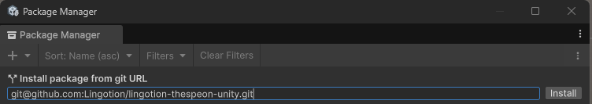
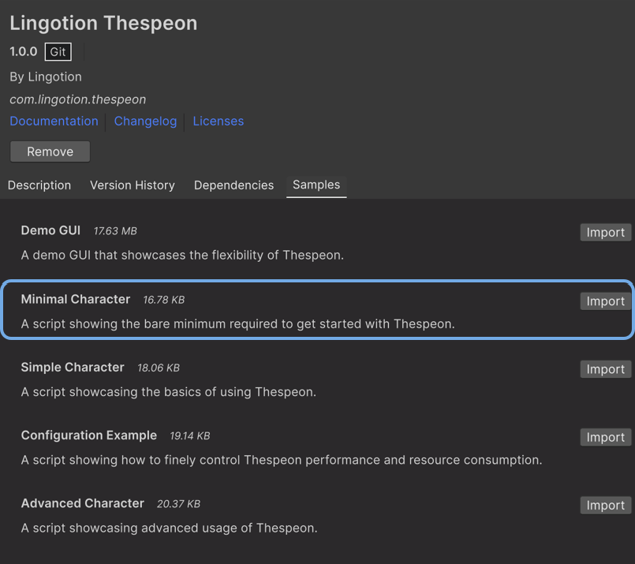
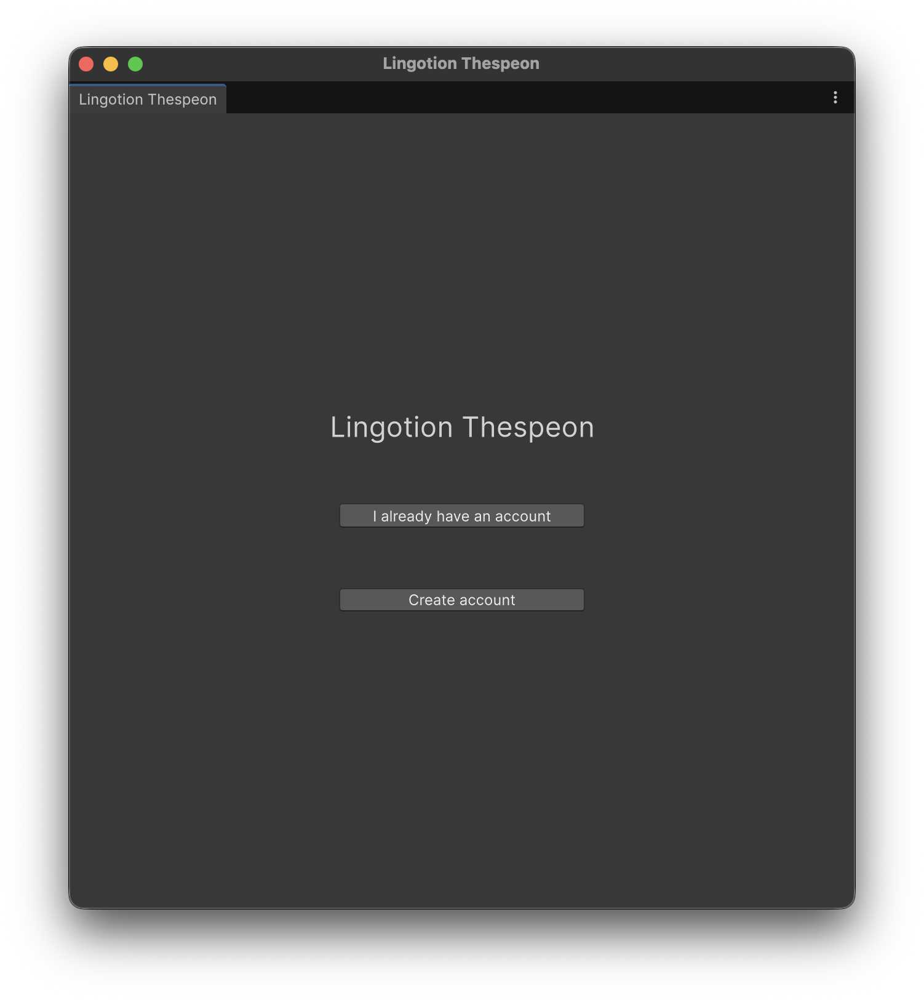
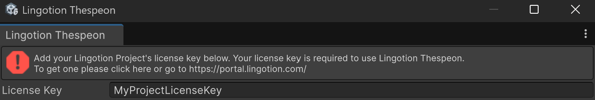
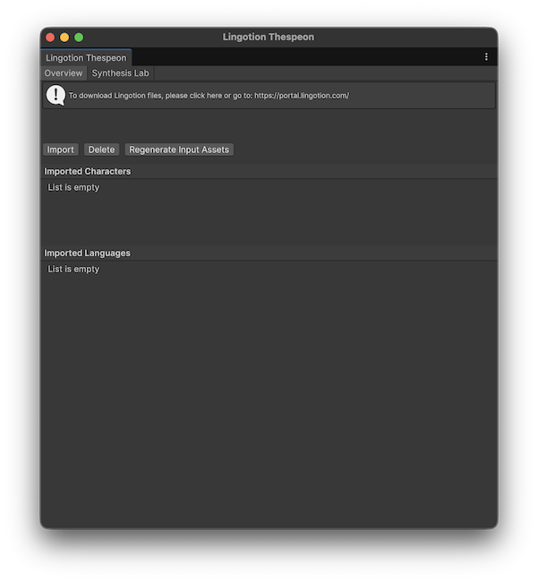
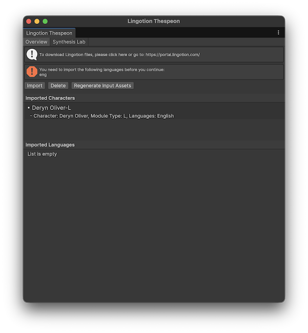
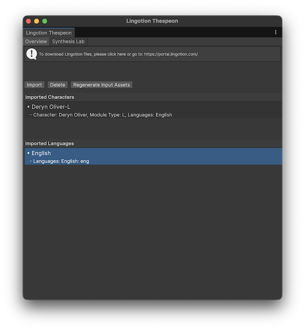

# Get Started - Unity

## Table of Contents
- [**Overview**](#overview)
- [**Install the Thespeon Unity Package**](#install-the-thespeon-unity-package)
  - [Importing Thespeon from git](#importing-thespeon-from-git)
  - [Import the Minimal Character sample](#import-the-minimal-character-sample)
- [**Get acquainted with the Thespeon Info Window**](#get-acquainted-with-the-thespeon-info-window)
- [**What Thespeon reports before you sign up**](#what-thespeon-reports-before-you-sign-up)
- [**Run the Minimal Character sample**](#run-the-minimal-character-sample)
- [**Next Steps**](#next-steps)

---

## Overview
This document details a step-by-step guide on how to install Lingotion Thespeon in your Unity project, as well as how to import the packs downloaded from the Lingotion Developer Portal.
This process has three main steps:
1. Install the Thespeon Package
2. Import the downloaded _.lingotion_ files
3. Run the _Minimal Character_ sample
> [!TIP]
> If you have not downloaded any _.lingotion_ files, please follow the [Get Started - Webportal](https://github.com/Lingotion/.github/blob/main/profile/portal-docs/get-started-webportal.md) guide before proceeding.
> 

--- 
## Install the Thespeon Unity Package
### Importing Thespeon from git


1. Open your Unity project.  
2. Go to **Unity > Window > Package Manager** from the top menu.  
3. Click the **+** (Add) button → **Install package from Git URL...**  
4. Paste the repository web URL:

   ```
   https://github.com/Lingotion/lingotion-thespeon-unity.git
   ```
  or if you use SSH:

   ```
   git@github.com:Lingotion/lingotion-thespeon-unity.git
   ```

5. Click **Install**.

Unity will now install the Thespeon package and its dependencies to your Unity project.

> [!TIP]
> You may also clone the package yourself and add it from disk if you wish to have a local copy.
> 
> [!IMPORTANT]
> The package samples use the **Unity Input System** package. Ensure your project has it installed and that **Active Input Handling** in **Edit > Project Settings > Player** is set to **Input System Package (New)** or **Both**.

### Import the Minimal Character sample
The Minimal Character sample contains a bare minimum example scene detailing how to use the package -- this will be the basis for this guide.



1. Find **Lingotion Thespeon** in the package list and open the **Samples** tab.
2. Click **Import** next to the Minimal Character sample.  Unity will create a copy of the sample in your project assets:
```
 Samples/Lingotion Thespeon/<version>/Minimal Character
 ```
3. Navigate to the sample directory and open the **Minimal Character.unity** scene.

---
## Get acquainted with the Thespeon Info Window
Now that the package is installed, we can import the downloaded character and language packs from the Lingotion developer portal. 

Thespeon has its own information window that displays an overview of installed characters and languages, tools for importing and deleting packs from the project, as well as a tab for audio synthesis laboration in Edit Mode.

1. To find the _Thespeon Info Window_, go to **Window > Lingotion > Thespeon Info** from the top menu. 

2. The window offers two ways to get set up. Choose the branch that applies to you:



> [!IMPORTANT] 
> Either branch requires an internet connection.
> 

   **Branch A — I already have an account**

   2A. Add your project's [license key](https://github.com/Lingotion/.github/blob/main/profile/portal-docs/get-started-webportal.md#creating-a-project) to the text box and press enter.

   

   Then continue with steps **3** and **4** below to import your downloaded packs.

   **Branch B — Create an account**

   If you don't have an account yet, Thespeon can set you up with starter models automatically.

   2B-1. Press the **Create account** button. Thespeon opens your web browser at the account signup page on the Lingotion Developer Portal.

   2B-2. Complete the signup and **accept the Terms of Service**.

   2B-3. **Copy the download token** shown on the portal once signup is complete.

   2B-4. Return to Unity and **paste the download token** into the Thespeon Info Window.

   Thespeon then automatically fills in your license key and downloads **two starter models**. When this finishes, your installation is ready to use -- you can skip the manual import steps below and go straight to [Run the Minimal Character sample](#run-the-minimal-character-sample).

3. _(Branch A)_ Press the **Import Pack** button and select your downloaded character pack from the webportal. The imported character(s) will show up under the **Imported Character Packs** list.





   Note the warning - this means that we need to import a corresponding language pack as well.

4.  _(Branch A)_ Now, press the "**Import Pack**" button again and select your downloaded language pack(s). The imported languages can be seen in the **Imported Language Packs** list.



If all languages that the chosen character pack supports are imported, you should see the warning disappear. Multilingual characters do not strictly need all their language packs to run and can be used as long as it has at least one, but its use will then be limited to that language only.
   
> [!TIP] 
> To remove an imported Character Pack or Language Pack, select the pack in its list and press the **Delete Pack** button. 
> 

---

## What Thespeon reports before you sign up

While Thespeon is installed but **not yet activated**, opening the _Thespeon Info Window_ sends
Lingotion one small message per editor session. It tells us that an install is sitting at the
signup screen, which is the one part of the setup process we otherwise cannot see -- it helps us
work out where people get stuck before they create an account.

The message contains only:

| Field | Value | Example |
|---|---|---|
| `installId` | A random identifier generated on your machine the first time it is needed | `cd33a5e8-0ba4-48fa-8499-75e6f33808e8` |
| `platform` | Always `unity` | `unity` |
| `origin` | Where the package came from | `assetstore` |
| `sdkVersion` | The Thespeon package version | `2.1.0` |
| `engineVersion` | Your Unity version | `6000.0.55f1` |

The install id is random and meaningless on its own. It is **not** derived from your name, your
machine, your hardware, your project, or any file path, and none of those are ever sent. If the
message cannot be delivered, Thespeon ignores the failure silently and carries on.

The id is stored in `UserSettings/Lingotion.Thespeon.install.json`. That folder is per-project and
per-user, and is excluded by Unity's standard `.gitignore`, so it is not shared with the rest of
your team and is not committed to source control.

Once you activate Thespeon with a license key, the message stops being sent.

If you go on to press **Create account**, the same install id is added to the signup link that
opens in your browser, so we can connect your new account to the install it came from. That only
happens when you deliberately choose to create an account.

See the [Terms of Service and Use](https://lingotion.com/terms-of-service/) for details.

---

## Run the Minimal Character sample
The _MinimalCharacter.cs_ script shows how easy it is to run Thespeon by only providing a single dialogue line -- this is the only thing that is explicitly required for Thespeon to synthesize audio. In the absence of parameters, Thespeon will do its best to fill in the blanks with default values. In the current case, the first available character is selected for you along with a fallback emotion and language.

Now that we have imported the character and language packs, we can start interfacing with the package. Enter play mode and press the **Space**, **Enter** or **S** key to initiate a synthesis and you should hear the imported character speak.

Feel free to check out the [other package samples](./samples.md) for more examples on how to use Thespeon!

> [!TIP]
> A quick way to interactively experiment with different lines in the Unity Editor is to use the **Audio Test Lab** under the **Characters** tab in the **Thespeon Info Window**.
---
## Next Steps
Now that you have successfully produced audio with your chosen character, you can follow the [Character Control Guide](./character-control.md) to learn how to direct how the character should speak their lines.

See the [Configuration and Performance Tuning Manual](./thespeon-configuration.md) for details on how to control the performance and memory usage of Thespeon.


